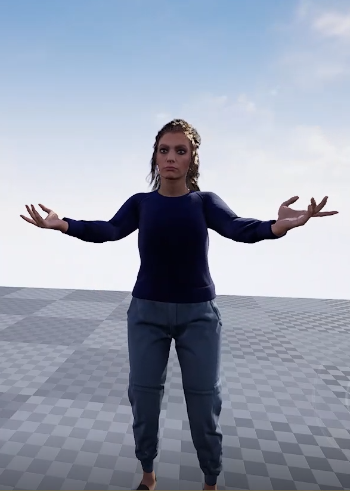
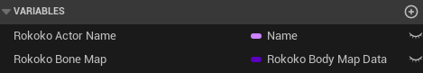
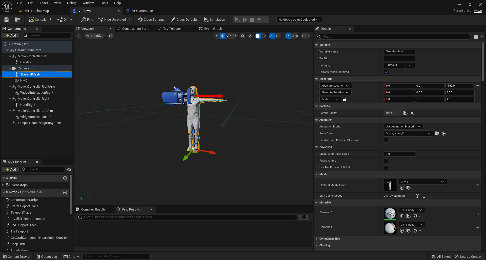
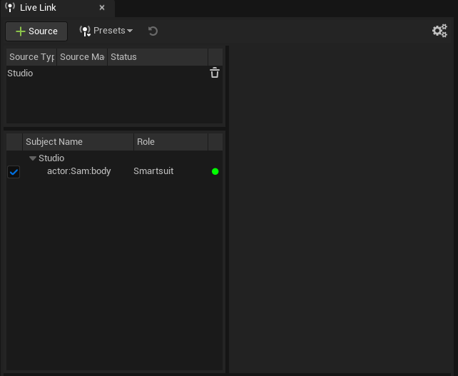
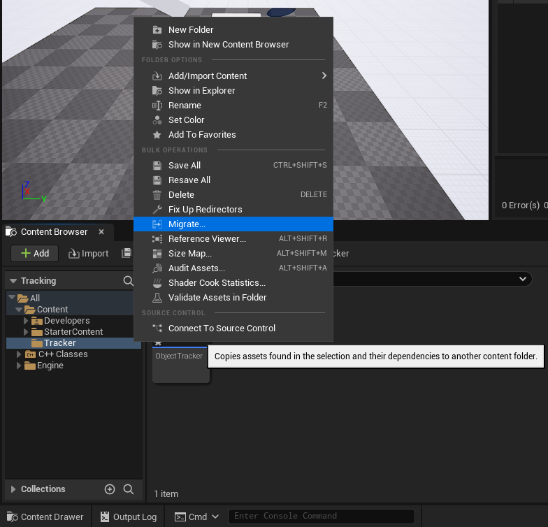
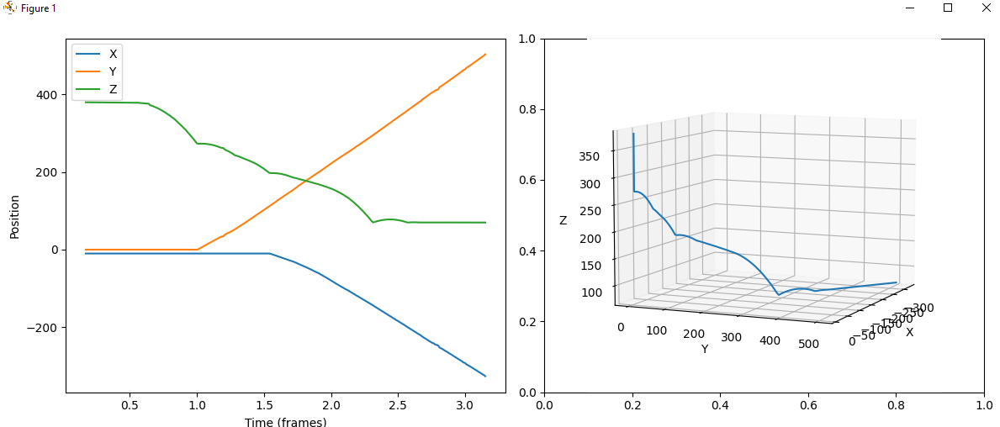

# Rokoko VR Simulation for Embodiment Measurement

This repository hosts the project conducted as a research assistant at the University of Glasgow under [Dr. Mathieu Chollet](https://matchollet.github.io/). The main objective was to create a VR simulation using the [Rokoko Smartsuit Pro II](https://www.rokoko.com/products/smartsuit-pro) and [Unreal Engine 5](https://www.unrealengine.com/en-US/unreal-engine-5) to measure the degree of embodiment.

## Table of Contents

- [Overview](#overview)
- [Useful Unreal Worlds](#useful-unreal-worlds)
- [Rokoko Studio](#rokoko-studio)
  - [Getting Started](#getting-started)
  - [Set Up Devices](#set-up-devices)
  - [Maintenance](#maintenance)
- [Unreal Engine](#unreal-engine)
  - [Dependencies](#dependencies)
  - [Project Setup](#project-setup)
    - [Metahumans](#metahumans)
    - [Mixamo Character](#mixamo-character)
    - [Embodying](#embodying-the-character)
  - [Mixamo Pipeline](#mixamo-pipeline)
  - [Animating the Character](#animating-the-character)
  - [Embodying the Character](#embodying-the-character)
- [Live Link](#live-link)
- [Virtual Reality](#virtual-reality)
- [Exporting to Other Projects](#exporting-to-other-projects)
- [Drift](#drift)
  - [Object Tracker](#object-tracker)
- [Mirror](#mirror)

### Useful Unreal Worlds

There are a few unreal worlds worth looking at. These are:

- **Tracking**  - This contains “Object tracker” use for tracking drift, find out more in the [drift](#drift) section.
- **UE427_Natalia** - This contains a metahuman that has been rigged to stream Rokoko Mocap.
- **MixamoPipeline -** This contains a few examples of rigged Mixamo characters using the *[Mixamo Pipeline](#mixamo-pipeline)* with the *[“Animating the Character”](#animating-the-character)* section.
- **VR_Testing -** This contains the VR template world provided by UE. This also uses the Mixamo pipeline but uses the *[“Embodying the character”](#embodying-the-character)* section.

## Rokoko studio

[Rokoko Studio]((https://www.rokoko.com/products/studio).) is a 3D animation software designed for motion capture data recording, streaming, and editing. It integrates with Rokoko's mocap tools, allowing users to animate and retarget in real-time. The platform supports platforms such as Unreal Engine, Unity, and Blender. 

### Getting started

Watch the [Rokoko onboarding](https://www.youtube.com/watch?v=YDaMf23DUq0&list=PL0nPCZDbYnms3zt1-A1cmf-S1fGyS6Rc3) series to get acquainted with all the components.

### Set up devices

This is covered in the [Rokoko onboarding](https://www.youtube.com/watch?v=YDaMf23DUq0&list=PL0nPCZDbYnms3zt1-A1cmf-S1fGyS6Rc3). To connect the suit plug the type-C cable into the hub and connect the USB to the computer. The process is the same for the gloves.

Once connected Rokoko should detect automatically. Configure the wifi settings, making sure the receiver IP is correct. This can be checked by typing `ipconfig` in the command line. connect to the IPv4 Address. Once configured the device manager should be as shown below. You can now unplug the device.

### Maintenance

Sensors can be removed from the smartsuit so that it can be washed. To do this follow [this tutorial](https://support.rokoko.com/hc/en-us/articles/4410409167249-How-do-I-wash-the-Smartsuit-Pro-). It takes aproximately 5 minutes to remove the electronics and 15 minutes to put them back.

## Unreal engine

### Dependencies

- Rokoko Livelink plugin for Unreal Engine.

- [Visual Studio](https://visualstudio.microsoft.com/) should be installed with the [relevant workloads](https://docs.unrealengine.com/5.1/en-US/setting-up-visual-studio-development-environment-for-cplusplus-projects-in-unreal-engine/)

### Project setup

The guide below contains the necessary information to set up a project for both custom characters and metahumans. This video also provides a bone maps folder that contains bone maps for retargeting as well as a T-pose asset for metahumans that places limbs in the correct pose for retargeting.

**Note:** The workflow in Unreal 4 and 5 is the same. The project provided in the video can be converted to UE 5 and should work fine.

:movie_camera: Watch this [video](https://www.youtube.com/watch?v=0ZSlEopk5zk&t=1217s) for the full process :movie_camera:

#### Metahumans

UE427_Natalia is a world that contains a metahuman and can also be downloaded from the video provided.

#### Mixamo character

The ["MixamoPipeline” UE world](#useful-unreal-worlds) contains some example characters that are rigged using the [Mixamo pipeline](#mixamo-pipeline).

#### Embodying

The ["VR_Testing” UE world](#useful-unreal-worlds) contains some example characters that are rigged using Mixamo pipeline as well as a “VR pawn” that is rigged to be attached to the character which follows from the *[“Embodying the character”](#embodying-the-character)* section*.*

### Mixamo pipeline

A Mixamo pipeline was designed so that different characters could be used easily. Mixamo was chosen as it provides a set of free characters as well as a simple way of [rigging custom characters](https://helpx.adobe.com/creative-cloud/help/mixamo-rigging-animation.html). The [Rokoko Guide](https://www.youtube.com/watch?v=0ZSlEopk5zk&t=1217s) was used to develop this workflow.

The following steps will describe how to use any character from Mixamo to live-link to the Rokoko suit:

1. Visit [mixamo](https://www.mixamo.com/) and if you haven’t already make an account.

2. In the “Characters” tab choose any character.

3. In the “Animation tab” choose the T-Pose as this will allow rokoko to map the animations correctly.

4. Download.

5. Open the folder called “MixamoPipeline”.

6. In the content browser create a new folder with the name of your character in the “Characters” folder
7. Open that folder and import the .fbx file ensuring that:
    - The Skeleton mesh is set to “None”
    - "Use T0 As Ref Pose" is checked
    - "Import Morph Targets" is checked

8. Import all.

9. Open the folder.

10. Right-click on the skeleton and “create > anim Blueprint” and open it.

11. Add 2 variables, “Rokoko Actor Name” and “Rokoko Bone Map” of types “Name” and “Rokoko Body Map Data > Class Reference” types respectively.

12. Add the following elements to the AnimGraph:

13. Compile this then set the “Rokoko Bone Map” to “MixamoCharacter_Bonemap” and compile and save again.

### Animating the character

1. Create a new actor and open
2. Add a skeletal mesh component

3. In the event Graph construct the following:

    The cast should be set to the anim Blueprint you created previously

4. Drag the Actor you created into the scene and set the anim class to the anim Blueprint you created and the mesh to the skeletal mesh.

### Embodying the character

1. In "*VRTemplate>Blueprints,”* make a copy of the VRpawn blueprint, open the “Viewport” and add a “SkeletalMesh” Component.

2. Set the Animation Mode to “Use animation blueprint”

3. Set the Anim class to the anim blueprint you created previously.

4. Set the skeletal mesh asset to the skeletal mesh of the character.

    

5. Go to the even graph and add to the end of the “Event BeginPlay”:

    

    **Note:** The first node should cast to the anim blueprint that you just created.

6. Open the VRGameMode and set the default pawn class to the pawn you just created.

## Live Link

In Rokoko studio, open a scene. In the Livestream tab, open the Unreal setting, take note of the port number, and **activate**.

The Rokoko receiver should have the same port number.

Once ports are correct, in unreal engine, go to *“Window > Virtual production > Live Link”* then in the Livelink *“+ source > Rokoko Studio Source”*

Remember that the name used in rokoko studio should match the one set in the [Mixamo pipeline](#embodying-the-character).

## Virtual Reality

This project was designed specifically for use with the [Vive headset](https://www.vive.com/uk/product/#pro%20series) but should work with any headset that is [Steam VR](https://store.steampowered.com/app/250820/SteamVR/) compatible

## Exporting to Other Projects

The best way to transfer assets from one project to another is to Migrate a folder. 

**Note:** This must be exported to another “content” folder.

## Drift

Tracking the drift is useful as it directly influences the person's sense of embodiment. With the [Sensor Fusion 2.0 update](https://www.rokoko.com/insights/sensor-fusion-2-0-more-accuracy-less-drift) , this should be reduced, however.

Made using C++, an object tracker can be located in the [Tracking](#useful-unreal-worlds) UE world.

### Object Tracker

Once placed in the world, the object tracker has two parts.

- Tracked object - Set to any object you wish to track
- Output CSVFile Path - currently set to “Saved/Logs/Tracking/” within the Unreal Engine world. This will be where the tracker outputs the object coordinates over time.

It will create a CSV file each day and append all the data collected that day to that file. This avoids creating a lot of files. To edit the “Object Tracker” Class you can open the “C++ Classes > Tracking > Object Tracker” and edit it. Make sure that you have the **[Visual Studio Integration Tool](https://www.unrealengine.com/marketplace/en-US/product/362651520df94e4fa65492dbcba44ae2) for UE 5.**

Below is a a simple plot demonstrating the tracked object from the Tracking world.

## Mirror

This was done quickly to investigate using a mirror in unreal.

The tutorial: [Create a Realistic Mirror](https://www.youtube.com/watch?v=kglwTYXTUV8) was used.

To get the mirror working the project settings need to be changed to ensure the reflection works. Go into “Edit>Project Settings>Rendering” and check “Support global clip plane for Planar Reflections” and set the “Dynamic Global Illumination Method” to “Screen Space”, finally uncheck motion blur and restart the project for the effects to take place.

The material is simple, set to the following:

